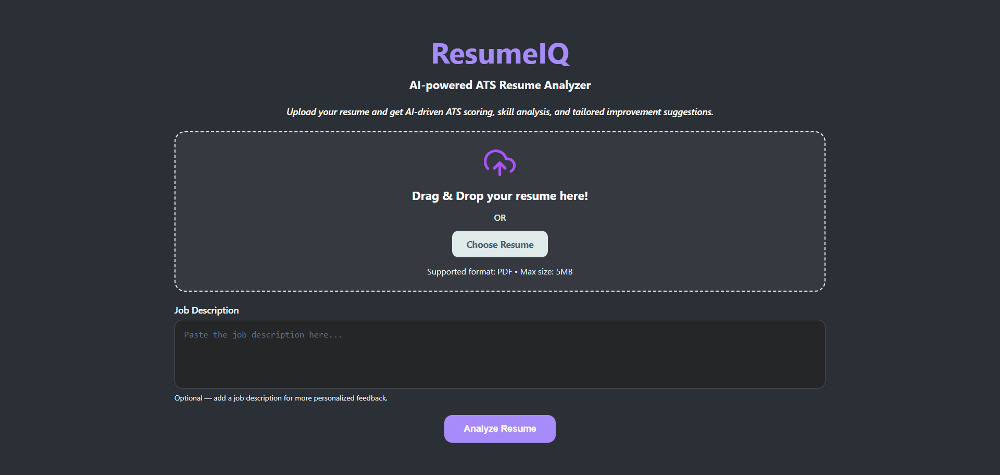

# ResumeIQ 🎯

An AI-powered ATS Resume Analyzer built with React, Node.js, Express, and Google Gemini AI.

ResumeIQ helps job seekers evaluate their resumes through ATS-style scoring, AI-powered insights, skill-gap detection, keyword analysis, and personalized improvement suggestions. Users can upload a resume, optionally provide a job description, and receive detailed feedback tailored to their profile.

## 🚀 Live Demo

- Frontend: [Live Demo](https://resume-iq-liart.vercel.app/)
- Backend: [API](https://resume-iq-1-wfn2.onrender.com)

---

## 📸 Screenshots

### Home Page



### Resume vs Job Description Analysis


### General Resume Analysis


---

## ✨ Features

* Upload PDF resumes for AI-powered ATS analysis
* Compare resumes against job descriptions
* ATS score and match score evaluation
* Matched skills and missing skills detection
* AI-generated strengths and improvement suggestions
* Resume keyword analysis and coverage scoring
* Technical proficiency breakdown across multiple domains
* Resume formatting feedback and recommendations
* Interactive dashboard with progress indicators
* Drag-and-drop resume upload
* Responsive and modern user interface

---

## 🛠️ Tech Stack

### Frontend

* React.js
* React Router DOM
* Axios
* React Circular Progressbar
* CSS3

### Backend

* Node.js
* Express.js
* Multer
* pdf-parse

### AI Integration

* Google Gemini API
* Structured JSON Prompting

---

## ⚙️ How It Works

1. Upload a PDF resume and optionally provide a job description.
2. Multer temporarily stores the uploaded file.
3. pdf-parse extracts the resume text.
4. The uploaded file is removed after processing.
5. Resume content is sent to Gemini AI using structured prompts.
6. Gemini returns a JSON-based analysis response.
7. Results are displayed through an interactive analytics dashboard.

---

## 📦 Local Setup

### Clone the Repository

```bash
git clone <your-repository-url>
```

### Backend Setup

```bash
cd Backend
npm install
```

Create a `.env` file inside the Backend folder:

```env
GEMINI_API_KEY=your_api_key
FRONTEND_URL=http://localhost:3000
PORT=5000
```

Start the backend server:

```bash
node index.js
```

### Frontend Setup

```bash
cd frontend
npm install
npm start
```
Create a `.env` file inside the Frontend folder:

```env
REACT_APP_BACKEND_URL=http://localhost:5000
```
---

## 🔮 Future Improvements

* Resume history tracking
* Downloadable analysis reports
* Multiple resume comparison
* Dark/Light mode

---

## 👩‍💻 Author

**Shubhdeep Kaur**

B.Tech CSE Student | MERN Stack Developer | DSA